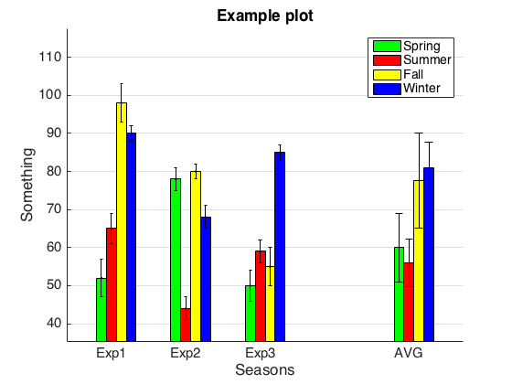

# plot_BwEB
This function plots a grouped bar chart together with error bars for a
given dataset (number of groups x number of categories). 
This function has the option to add an extra group to
represent the average of the categories across the given dataset. 
The error bars in the average grouped bars (with x-axis tick label as 
'AVG') indicate the standard error of the mean. 

Here is an example: 


  
## Sample usage
code{
data = [52, 65, 98, 90; 78, 44, 80, 68; 50, 59, 55, 85];
err = [5, 4, 5, 2; 3, 3, 2, 3; 4, 3, 5, 2]; 

colors = {'g','r','y','b'}; 
legend = {'Spring', 'Summer', 'Fall', 'Winter'};
XTickLabel = {'Exp1', 'Exp2', 'Exp3'};
```matlab
plot_BwEB(data, err, colors, 'title','Example plot','avg',1,'fontsize',15,...
        'GridOn',1, 'legends',legend, 'ylabel','Something',...
        'xlabel','Seasons', 'XTickLabel', XTickLabel)
```
